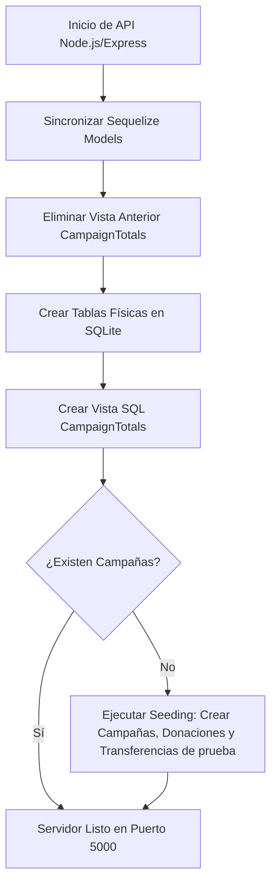
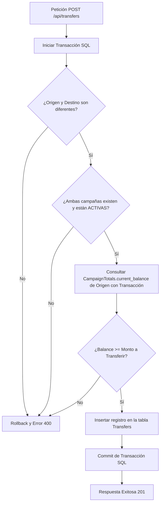

# Flujo de Funcionamiento y Consultas SQL de Verificación - Donis

Este documento detalla el **flujo de funcionamiento** del sistema de donaciones y transferencias de la plataforma **Donis** y provee las **consultas SQL** necesarias para auditar y verificar la integridad de la base de datos (SQLite).

---

## 1. Estructura de Datos y Modelo Relacional

La base de datos del sistema consta de tres tablas principales y una **Vista SQL** calculada dinámicamente:

1. **`Campaigns` (Campañas)**: Registra las causas o campañas de recaudación de fondos.
   * `id` (INTEGER, PK, Autoincremental)
   * `title` (VARCHAR, obligatorio)
   * `description` (TEXT)
   * `targetAmount` (DECIMAL, obligatorio)
   * `status` (ENUM: 'active', 'completed', 'paused')
   * `createdAt` / `updatedAt` (Timestamps)
2. **`Donations` (Donaciones)**: Registra los ingresos externos de dinero hacia campañas.
   * `id` (INTEGER, PK, Autoincremental)
   * `campaignId` (INTEGER, FK -> Campaigns.id)
   * `amount` (DECIMAL, obligatorio, > 0)
   * `donorName` (VARCHAR, default 'Anónimo')
   * `comment` (TEXT)
   * `createdAt` / `updatedAt` (Timestamps)
3. **`Transfers` (Transferencias)**: Registra los traspasos internos de excedente de saldo de una campaña activa a otra.
   * `id` (INTEGER, PK, Autoincremental)
   * `sourceCampaignId` (INTEGER, FK -> Campaigns.id, Origen)
   * `targetCampaignId` (INTEGER, FK -> Campaigns.id, Destino)
   * `amount` (DECIMAL, obligatorio, > 0)
   * `reason` (VARCHAR)
   * `createdAt` / `updatedAt` (Timestamps)
4. **`CampaignTotals` (Vista SQL)**: Centraliza los cálculos de agregación y el cálculo del balance de saldo actual para cada campaña en tiempo real.

### Fórmula para el Balance Neto de una Campaña
$$\text{Balance Actual} = \text{Total Donaciones Recibidas} - \text{Total Transferencias Enviadas} + \text{Total Transferencias Recibidas}$$

---

## 2. Flujo de Funcionamiento del Sistema

El comportamiento de la aplicación está diseñado para asegurar las propiedades **ACID** (Atomicidad, Consistencia, Aislamiento y Durabilidad) en las operaciones financieras críticas.

### A. Flujo de Inicialización y Configuración (Backend Startup)
Cuando se arranca el servidor (`npm run dev` o mediante `./start.sh`):
1. **Conexión a Base de Datos**: Se establece conexión con SQLite en `backend/database.sqlite` utilizando Sequelize.
2. **Destrucción y Recreación de Vistas**: `initDatabase()` ([index.js](file:///home/lisandro/Documentos/BDD-Competencia/backend/models/index.js)) elimina cualquier vista preexistente de `CampaignTotals` para evitar conflictos durante la sincronización de modelos.
3. **Sincronización de Tablas**: Se crean las tablas físicas `Campaigns`, `Donations`, y `Transfers` si no existen.
4. **Instanciación de la Vista**: Se ejecuta la instrucción SQL `CREATE VIEW CampaignTotals AS ...` que define la agregación.
5. **Sembrado de Datos (Seeding)**: Si la tabla `Campaigns` no contiene registros, se autogeneran tres campañas de prueba, cuatro donaciones y una transferencia inicial de saldo de $30.000 para demostración inmediata.



---

### B. Flujo de Registro de Donación
Cuando un donante realiza un aporte económico a una campaña:
1. El frontend envía un `POST` a `/api/donations` con el `campaignId` y el `amount`.
2. El controlador inicia una **Transacción SQL** (`sequelize.transaction()`).
3. **Validación de Existencia**: Se busca la campaña en la base de datos dentro de la transacción. Si no existe, se hace `rollback()` y se aborta.
4. **Validación de Estado**: Se verifica que la campaña esté en estado `'active'`. No se permite donar a campañas pausadas o finalizadas (se hace `rollback()`).
5. **Inserción**: Se inserta el registro en la tabla `Donations`.
6. **Confirmación**: Se hace `commit()` de la transacción, guardando permanentemente la donación.

---

### C. Flujo de Transferencia de Fondos (Excedente) entre Campañas
Cuando una campaña tiene saldo disponible y se decide redistribuir fondos a otra causa activa necesitada:
1. El frontend envía un `POST` a `/api/transfers` con `sourceCampaignId` (origen), `targetCampaignId` (destino), `amount` y `reason`.
2. Se inicia una **Transacción SQL** controlada.
3. **Validación Inicial**: Se verifica que la campaña de origen no sea la misma que la de destino.
4. **Validación de Existencia y Estado**: Se buscan y bloquean ambas campañas. Ambas deben existir y estar en estado `'active'`. Si una no cumple, se hace `rollback()`.
5. **Verificación de Fondos del Emisor**: 
   * Se consulta el registro de saldo actual de la campaña emisora consultando directamente a la vista `CampaignTotals` pasándole la transacción activa: 
     `SELECT current_balance FROM CampaignTotals WHERE id = sourceCampaignId`
   * Si `current_balance` es inferior al monto solicitado (`amount`), **se rechaza la operación**. Se ejecuta `rollback()` para evitar balances negativos e inconsistencia de caja.
6. **Registro del Traspaso**: Si hay fondos suficientes, se inserta una fila en la tabla `Transfers` asociando el débito/crédito.
7. **Confirmación**: Se ejecuta `commit()`. Al ser un modelo dinámico, la vista `CampaignTotals` reflejará el cambio de balance de forma automática e inmediata en ambas campañas, manteniendo la integridad del sistema.



---

## 3. Consultas SQL de Verificación de Datos

Las siguientes consultas SQL son directamente ejecutables sobre el archivo `database.sqlite` (usando comandos bash, extensiones de editor, DBeaver u otros gestores de bases de datos) para diagnosticar, auditar y validar el estado de la plataforma.

### Consulta 1: Diagnóstico de Estructura de Base de Datos
Permite verificar que las tablas principales y la vista calculada se encuentren presentes en la base de datos.
```sql
SELECT name, type 
FROM sqlite_master 
WHERE type IN ('table', 'view') 
  AND name NOT LIKE 'sqlite_%';
```

---

### Consulta 2: Monitoreo General de Campañas, Balances y Avance
Muestra las metas, saldos actuales y el porcentaje de avance hacia la meta para cada una de las campañas registradas.
```sql
SELECT 
  id, 
  title AS campana, 
  status AS estado,
  targetAmount AS meta, 
  current_balance AS balance_actual,
  donation_count AS cantidad_donaciones,
  ROUND((current_balance * 100.0 / targetAmount), 2) AS porcentaje_avance
FROM CampaignTotals
ORDER BY current_balance DESC;
```

---

### Consulta 3: Auditoría y Desglose Manual de Saldos (Validación de la Vista)
Esta consulta calcula manualmente de forma explícita el saldo neto acumulado a través de subconsultas directas sobre las tablas físicas `Donations` y `Transfers`. Permite validar que el cálculo dinámico de la vista `CampaignTotals` sea 100% correcto y no existan discrepancias.
```sql
SELECT 
  c.id,
  c.title AS campana,
  COALESCE(d.total_donado, 0) AS total_donaciones,
  COALESCE(ts.total_enviado, 0) AS transferencias_enviadas,
  COALESCE(tr.total_recibido, 0) AS transferencias_recibidas,
  (COALESCE(d.total_donado, 0) - COALESCE(ts.total_enviado, 0) + COALESCE(tr.total_recibido, 0)) AS balance_calculado_manual,
  vt.current_balance AS balance_de_la_vista,
  -- Diferencia entre el cálculo manual y la vista (debe ser 0)
  ((COALESCE(d.total_donado, 0) - COALESCE(ts.total_enviado, 0) + COALESCE(tr.total_recibido, 0)) - vt.current_balance) AS discrepancia
FROM Campaigns c
LEFT JOIN (
  SELECT campaignId, SUM(amount) AS total_donado
  FROM Donations
  GROUP BY campaignId
) d ON c.id = d.campaignId
LEFT JOIN (
  SELECT sourceCampaignId, SUM(amount) AS total_enviado
  FROM Transfers
  GROUP BY sourceCampaignId
) ts ON c.id = ts.sourceCampaignId
LEFT JOIN (
  SELECT targetCampaignId, SUM(amount) AS total_recibido
  FROM Transfers
  GROUP BY targetCampaignId
) tr ON c.id = tr.targetCampaignId
JOIN CampaignTotals vt ON c.id = vt.id;
```

---

### Consulta 4: Libro Diario de Movimientos por Campaña (Ledger / Historial de Caja)
Muestra de manera unificada, cronológica y ordenada todos los eventos de entrada y salida de caja de una campaña específica. Útil para reconstruir detalladamente el balance de una campaña desde su creación.
*(Ejemplo filtrado para la Campaña con ID = 1; cambie el filtro `campaignId = 1`, `sourceCampaignId = 1` y `targetCampaignId = 1` para auditar otras).*
```sql
SELECT 
  'DONACION' AS tipo_movimiento,
  d.id AS operacion_id,
  d.amount AS monto,
  'Donante: ' || d.donorName || ' - Detalle: ' || COALESCE(d.comment, 'Sin comentario') AS detalle,
  d.createdAt AS fecha
FROM Donations d
WHERE d.campaignId = 1

UNION ALL

SELECT 
  'TRANSFERENCIA_ENVIADA' AS tipo_movimiento,
  t.id AS operacion_id,
  -t.amount AS monto,
  'Hacia Campaña ID ' || t.targetCampaignId || ' - Motivo: ' || COALESCE(t.reason, 'Sin motivo') AS detalle,
  t.createdAt AS fecha
FROM Transfers t
WHERE t.sourceCampaignId = 1

UNION ALL

SELECT 
  'TRANSFERENCIA_RECIBIDA' AS tipo_movimiento,
  t.id AS operacion_id,
  t.amount AS monto,
  'Desde Campaña ID ' || t.sourceCampaignId || ' - Motivo: ' || COALESCE(t.reason, 'Sin motivo') AS detalle,
  t.createdAt AS fecha
FROM Transfers t
WHERE t.targetCampaignId = 1

ORDER BY fecha ASC;
```

---

### Consulta 5: Verificaciones de Integridad Financiera y Consistencia

#### A. Detección de Balances Negativos
El saldo de ninguna campaña debe ser inferior a cero. Si esta consulta devuelve registros, existe un error de concurrencia o de validación de saldo en el backend.
```sql
SELECT id, title, current_balance 
FROM CampaignTotals 
WHERE current_balance < 0;
```

#### B. Conciliación de Caja Global (Consistencia de Masa Monetaria)
El total de dinero distribuido en las campañas debe equivaler exactamente a la suma de todas las donaciones ingresadas externamente. El resultado de `diferencia_conciliacion` debe dar exactamente `0`.
```sql
SELECT 
  (SELECT SUM(amount) FROM Donations) AS total_donado_ingresado,
  (SELECT SUM(current_balance) FROM CampaignTotals) AS total_saldos_existentes,
  (
    (SELECT SUM(amount) FROM Donations) - 
    (SELECT SUM(current_balance) FROM CampaignTotals)
  ) AS diferencia_conciliacion;
```

#### C. Control de Operaciones sobre Campañas No Activas
Busca si se registraron donaciones o transferencias asociadas a campañas que estuvieran inactivas o pausadas.
```sql
SELECT c.id, c.title AS campana, c.status AS estado, 'DONACION_ERRONEA' AS tipo_error, d.amount, d.createdAt AS fecha
FROM Campaigns c
JOIN Donations d ON c.id = d.campaignId
WHERE c.status != 'active'

UNION ALL

SELECT c.id, c.title AS campana, c.status AS estado, 'TRANSF_ENVIADA_ERRONEA' AS tipo_error, t.amount, t.createdAt AS fecha
FROM Campaigns c
JOIN Transfers t ON c.id = t.sourceCampaignId
WHERE c.status != 'active'

UNION ALL

SELECT c.id, c.title AS campana, c.status AS estado, 'TRANSF_RECIBIDA_ERRONEA' AS tipo_error, t.amount, t.createdAt AS fecha
FROM Campaigns c
JOIN Transfers t ON c.id = t.targetCampaignId
WHERE c.status != 'active';
```

---

### Consulta 6: Reporte Completo de Donaciones
Lista de todas las donaciones individuales con el título de la campaña asociada, ordenadas de las más recientes a las más antiguas.
```sql
SELECT 
  d.id AS donacion_id,
  d.donorName AS donante,
  d.amount AS monto,
  c.title AS campana,
  d.comment AS comentario,
  d.createdAt AS fecha
FROM Donations d
JOIN Campaigns c ON d.campaignId = c.id
ORDER BY d.createdAt DESC;
```

---

### Consulta 7: Reporte Completo de Transferencias Inter-Campañas
Lista de auditoría detallada de todos los movimientos de fondos que se realizaron entre campañas.
```sql
SELECT 
  t.id AS transferencia_id,
  c_orig.title AS campana_origen,
  c_dest.title AS campana_destino,
  t.amount AS monto_transferido,
  t.reason AS motivo,
  t.createdAt AS fecha
FROM Transfers t
JOIN Campaigns c_orig ON t.sourceCampaignId = c_orig.id
JOIN Campaigns c_dest ON t.targetCampaignId = c_dest.id
ORDER BY t.createdAt DESC;
```
